# 🎓 Sistem Informasi Akademik Mahasiswa - Premium Dashboard

### 👥 Anggota Kelompok
* **Mosyarofah** - `202412036` *(Ketua Kelompok)*
* **Muhammad Ikbal** - `202412008`
* **Achmad Gibran** - `202412003`

### 💡 Pernyataan Karakteristik Sistem
Aplikasi Sistem Informasi Akademik Mahasiswa (SIAM) ini dibangun menggunakan arsitektur **Native Vanilla Web-Development** (Pure HTML5, CSS3, dan Vanilla JavaScript ES6) secara murni. Proyek ini dirancang **tanpa menggunakan framework JavaScript** (seperti React, Vue, atau Angular) dan **tanpa framework CSS** (seperti Bootstrap atau Tailwind CSS). 

Seluruh fungsionalitas *Single Page Application* (SPA), sistem manajemen tata letak responsif, validasi data berlapis, hingga mekanisme penyimpanan persisten berbasis *client-side* (**LocalStorage**) dikembangkan secara manual dari dasar (*from scratch*) guna memenuhi instruksi orisinalitas perangkat lunak.

---

## 🚀 13 Fitur Utama Aplikasi

Berikut adalah implementasi rincian 13 fitur utama yang terintegrasi secara penuh di dalam sistem:

### 1. Dashboard Statistik dengan Chart.js
* **Deskripsi:** Menyediakan visualisasi data *real-time* dalam bentuk grafik interaktif untuk membantu analisis distribusi data mahasiswa.
* **Komponen Grafik:**
    * *Doughnut Chart:* Distribusi data berdasarkan Jenis Kelamin.
    * *Bar Chart:* Jumlah mahasiswa per Program Studi/Jurusan.
    * *Line Chart:* Tren pertumbuhan jumlah mahasiswa per Angkatan.
    * *Bar Chart (Umur):* Sebaran data umur mahasiswa untuk melihat demografi usia.
* **Optimasi:** Perhitungan data statistik dilakukan dalam satu kali perulangan (*single loop array traversal*) untuk menjaga performa aplikasi tetap ringan.
* **Bukti Implementasi:**
   
  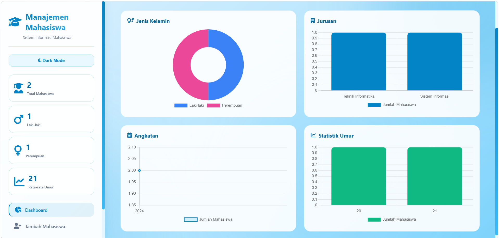

---

### 2. Validasi NIM Unik
* **Deskripsi:** Menjamin integritas data dengan mencegah adanya duplikasi Nomor Induk Mahasiswa (NIM) di dalam sistem.
* **Logika Bisnis:** Sistem akan melakukan pengecekan (*array validation*) ke dalam `localStorage`. Jika NIM sudah terdaftar oleh pengguna lain, sistem akan memblokir proses *submit* dan menampilkan pesan error secara *real-time* tanpa menghapus input data lainnya.
* **Bukti Implementasi:**
   
  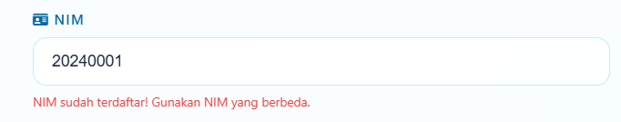

---

### 3. Validasi Password Minimal 6 Karakter
* **Deskripsi:** Fitur keamanan dasar untuk memastikan akun mahasiswa yang didaftarkan memiliki kredensial yang aman.
* **Logika Bisnis:** Field password wajib diisi untuk data baru dan opsional saat mode edit. Jika pengguna memasukkan kurang dari 6 karakter, sistem secara otomatis memicu komponen error handler bawah input.
* **Bukti Implementasi:**
   
  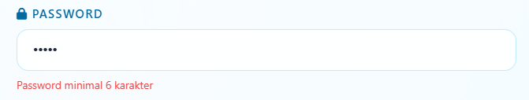

---

### 4. Validasi Umur Minimal 17 Tahun
* **Deskripsi:** Memastikan validitas data kelahiran mahasiswa sesuai dengan regulasi akademik standar perkuliahan.
* **Logika Bisnis:** Menggunakan fungsi pembantu `calculateAge(birthDate)`. Sistem menghitung selisih tanggal lahir dengan tanggal hari ini (*current date*). Jika hasil kalkulasi menunjukkan usia kurang dari 17 tahun, form akan menolak proses penyimpanan.
* **Bukti Implementasi:**
   
  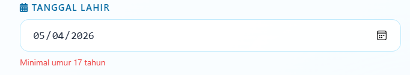

---

### 5. Live Search Data Mahasiswa
* **Deskripsi:** Mempermudah pencarian data mahasiswa secara instan tanpa perlu memuat ulang halaman (*zero-reload*).
* **Logika Bisnis:** Memanfaatkan *event listener* `oninput` pada kolom pencarian. Sistem melakukan filter *case-insensitive* pada properti `nama` dan `nim` secara simultan seiring pengguna mengetik karakter.
* **Bukti Implementasi:**
   
  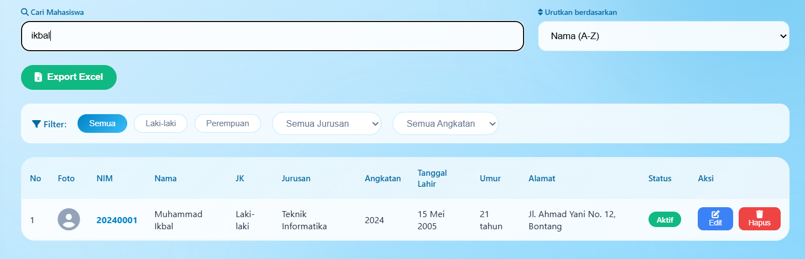

---

### 6. Filter Jenis Kelamin, Jurusan, dan Angkatan
* **Deskripsi:** Menyediakan kontrol penuh bagi pengguna untuk memilah data secara spesifik berdasarkan multiparameter.
* **Logika Bisnis:** Filter bersifat akumulatif (kombinasi). Pengguna dapat menyaring data berdasarkan kombinasi Jenis Kelamin (Semua/Laki-laki/Perempuan), Jurusan Tertentu, serta Angkatan tertentu secara bersamaan.
* **Bukti Implementasi:**
   
  

---

### 7. Sorting Nama, NIM, dan Umur
* **Deskripsi:** Mengurutkan data pada tabel mahasiswa untuk mempermudah pembacaan dokumen data yang besar.
* **Logika Bisnis:** Mendukung pengurutan dua arah (*Ascending* & *Descending*) untuk kolom Nama (`nama` & `namaDesc`), NIM (`nim` & `nimDesc`), serta Umur (`umur` & `umurDesc`) dengan penanganan khusus nilai kosong (`-`).
* **Bukti Implementasi:**
   
  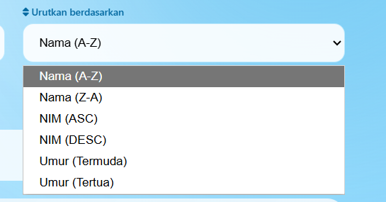

---

### 8. Export Data ke Excel
* **Deskripsi:** Fitur utilitas untuk memindahkan data lokal ke dalam format spreadsheet yang siap cetak atau diolah lebih lanjut.
* **Logika Bisnis:** Menggunakan pustaka `xlsx.full.min.js`. Data objek JavaScript dipetakan (*mapping*) ke struktur kolom yang rapi, dikonversi menjadi *worksheet*, and diunduh langsung dengan penamaan berkas otomatis menggunakan format tanggal saat ini: `data_mahasiswa_YYYY-MM-DD.xlsx`.
* **Bukti Implementasi:**
   
  

---

### 9. Dark Mode dan Light Mode
* **Deskripsi:** Menyediakan kenyamanan visual bagi pengguna dalam berbagai kondisi pencahayaan (mengurangi kelelahan mata).
* **Logika Bisnis:** Menggunakan manipulasi class token list pada `document.body.classList.toggle("dark-mode")`. Seluruh variabel warna CSS akan beralih ke palet gelap/terang secara harmonis disertai perubahan ikon tombol navigasi.
* **Bukti Implementasi:**
   
  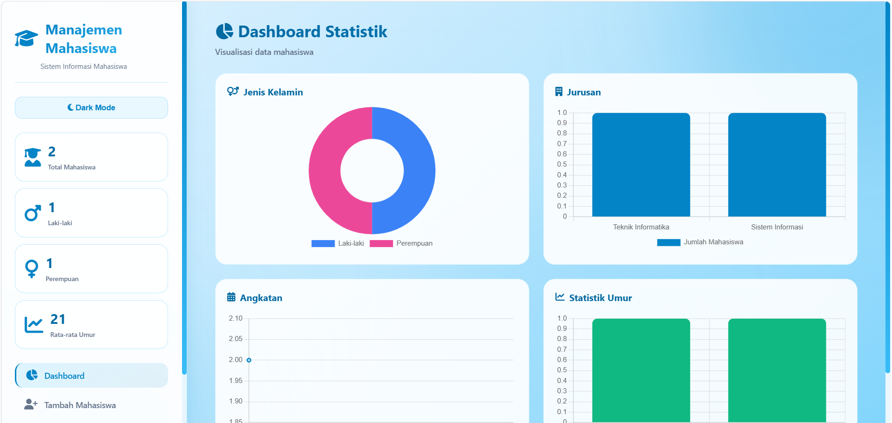
   
  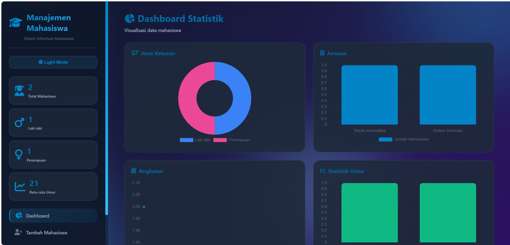

---

### 10. Upload Foto Profil
* **Deskripsi:** Personalisasi identitas visual mahasiswa di dalam sistem menggunakan berkas gambar asli.
* **Logika Bisnis:** Berkas gambar yang diunggah diproses melalui objek `FileReader()` menggunakan arsitektur *Asynchronous Promise* untuk dikonversi menjadi skema **Base64 Data URI**. Skema ini memungkinkan gambar disimpan langsung sebagai teks di dalam LocalStorage tanpa memerlukan server penyimpanan gambar eksternal.
* **Bukti Implementasi:**
   
  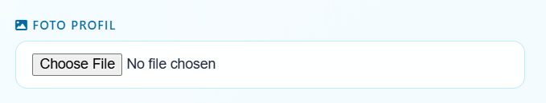

---

### 11. Penyimpanan dengan LocalStorage
* **Deskripsi:** Menjaga data tetap aman dan tidak hilang meskipun peramban web (*browser*) ditutup atau halaman disegarkan (*refresh*).
* **Logika Bisnis:** Memanfaatkan API `localStorage.getItem()` and `localStorage.setItem()`. Data array objek JavaScript diserialisasi menjadi string JSON saat disimpan, and diparsing kembali menjadi array saat aplikasi pertama kali dimuat.
* **Bukti Implementasi:**
   
  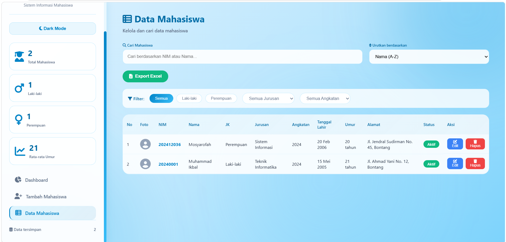

---

### 12. Pagination
* **Deskripsi:** Membatasi jumlah tampilan baris data di dalam tabel agar antarmuka tetap rapi dan performa rendering DOM tetap terjaga.
* **Logika Bisnis:** Variabel `limit` ditetapkan sebanyak 5 baris per halaman. Nomor halaman dihitung secara dinamis berdasarkan total data yang lolos dari filter/pencarian. Tombol navigasi halaman akan dibuat secara dinamis dan memiliki penanda visual aktif (*premium active styling*).
* **Bukti Implementasi:**
   
  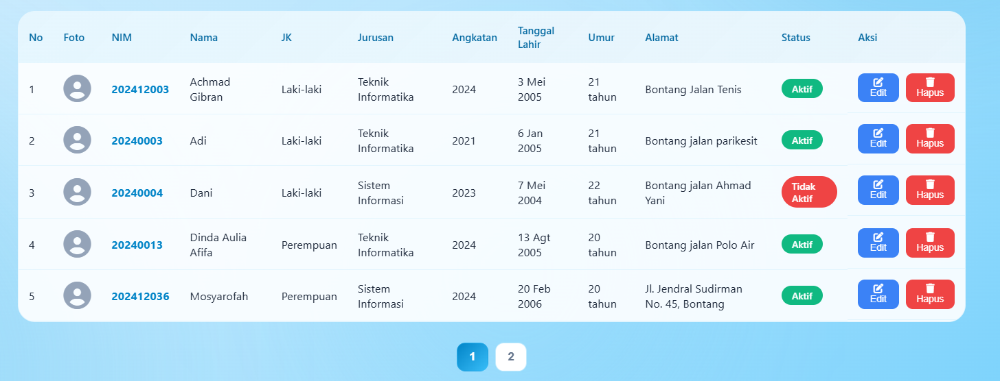

---

### 13. Status Mahasiswa Aktif dan Tidak Aktif
* **Deskripsi:** Memberikan penanda status registrasi operasional mahasiswa di dalam kampus.
* **Logika Bisnis:** Status dipilih melalui elemen dropdown form (Aktif/Tidak Aktif). Di dalam tabel, status diubah menjadi komponen visual *badge* dengan warna hijau (*emerald*) untuk status 'Aktif' and warna merah (*rose*) untuk status 'Tidak Aktif'.
* **Bukti Implementasi:**
   
  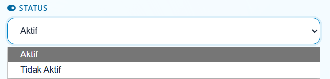

---

### [BUG FIX] Penanganan Tampilan Tabel Tergeser
* **Deskripsi:** Memperbaiki kendala visual di mana posisi teks judul header tabel (`<thead>`) tidak lurus vertikal dengan baris isi data mahasiswa (`<tbody>`).
* **Logika / Penyebab Bug:** Terjadi selisih jumlah kolom pada kode JavaScript di file `js/app.js`. Pada fungsi `render()`, baris string literal `<tr>` tidak sengaja menyisipkan tag `<td>` kosong tambahan di paling awal, sehingga baris data memiliki total 12 kolom sedangkan baris header hanya memiliki 11 kolom (`<th>`). Selisih ini membuat isi tabel terdorong ke kanan.
* **Solusi Perbaikan:** Menghapus elemen tag `<td>` kosong di dalam fungsi `render()` agar jumlah kolom *header* dan *body* kembali sinkron (pas 11 kolom), serta memastikan CSS menggunakan aturan `display: table;` dan `border-collapse: collapse;` yang presisi.
* **Bukti Implementasi (Sebelum & Sesudah):**
   
  <strong>Sebelum Perbaikan (Tampilan Geser):</strong>
   
  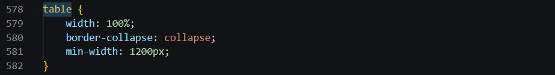
  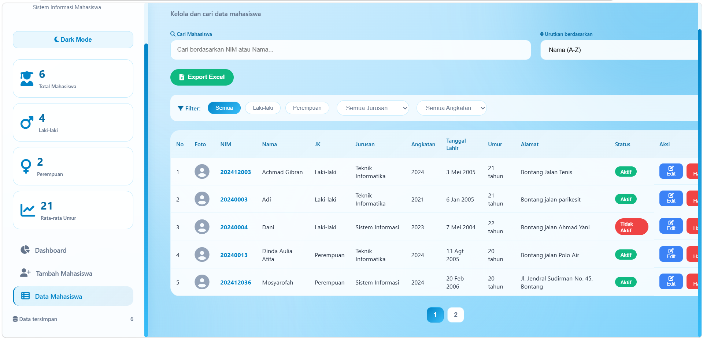
   
    
  <strong>Sesudah Perbaikan (Tampilan Presisi):</strong>
   
  
  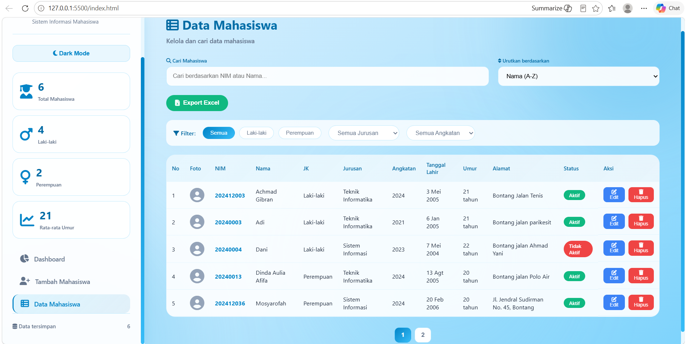
   